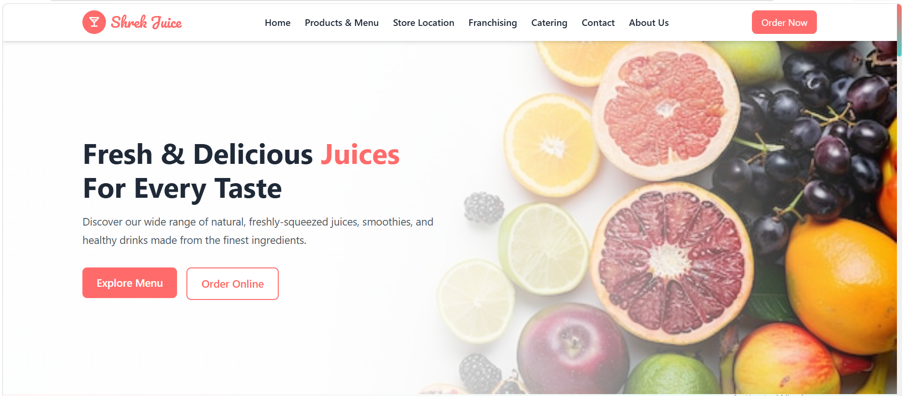

# Shrek Juice Centre

A modern, responsive multi-page website for **Shrek Juice Centre** — a premium juice bar based in Karachi, Pakistan. The site offers online menu browsing, catering services, franchising applications, and contact functionality.

---

## Preview



---

## Live Demo

> Open `https://iqracodelab.github.io/Shrek-Juice-Centre-eProject/` in your browser to view the site locally.

---

## Features

- **Responsive Design** — Fully mobile-friendly with hamburger navigation
- **4 Pages** — Home, Catering, Contact, Franchising
- **40+ Products** across 7 categories (Fruit Juices, Vegetable Juices, Smoothies, Protein Shakes, Winter Menu, Chocolate Juices, Mocktails)
- **Product Detail Modal** — Size selection, nutrition info, add-to-cart flow
- **Interactive Tabs** — Category-based menu filtering
- **Catering Packages** — 3 tiers (Basic Sip, Fiesta Blend, Royal Splash)
- **Franchise Application Form** — Full inquiry with budget selection
- **Contact Form** — With EmailJS integration for email delivery
- **Embedded Google Maps** — Store location on Contact & Home pages
- **Social Media Integration** — WhatsApp, Facebook, Instagram, TikTok, X
- **Smooth Animations** — CSS keyframe transitions and hover effects
- **Scroll-to-Top Button** — Auto-visible after scrolling

---

## Tech Stack

| Technology | Purpose |
|---|---|
| **HTML5** | Page structure |
| **CSS3** | Custom styling |
| **Tailwind CSS 3.4** (CDN) | Utility-first responsive layout |
| **Vanilla JavaScript** | Interactivity & DOM manipulation |
| **Remix Icon 4.6** (CDN) | Icon library |
| **Google Fonts** | Pacifico + Poppins |
| **EmailJS 4.x** (CDN) | Client-side email sending |

---

## Project Structure

```
project/
├── index.html              # Homepage
├── catering.html           # Catering services page
├── contact.html            # Contact us page
├── franchaising.html       # Franchising opportunities page
│
├── css/
│   ├── common.css          # Shared/global styles
│   ├── home.css            # Homepage styles
│   ├── catering.css        # Catering page styles
│   ├── contact.css         # Contact page styles
│   └── franchaising.css    # Franchising page styles
│
├── js/
│   ├── common.js           # Shared JS (mobile menu, scroll-to-top, active nav)
│   ├── home.js             # Homepage JS (tabs, modals, cart, ratings, EmailJS)
│   └── catering.js         # Catering page JS (image preview)
│
└── img/
    └── (114 images — fruits, juices, vegetables, smoothies, etc.)
```

---

## Getting Started

### Prerequisites

- A modern web browser (Chrome, Firefox, Edge, Safari)
- No build tools or package manager required

### Installation

```bash
# Clone the repository
git clone https://github.com/your-username/shrek-juice-centre.git

# Navigate to the project directory
cd shrek-juice-centre

# Open in browser
start index.html    # Windows
open index.html     # macOS
xdg-open index.html # Linux
```

Or simply double-click `index.html` to open it directly in your browser.

---

## Pages Overview

### Home (`index.html`)
- Hero section with CTA buttons
- Signature drinks showcase
- Tabbed product menu (7 categories, 40+ items)
- Product detail modal with size/quantity selection
- Health tips section
- Services overview with embedded map
- Customer testimonials
- Newsletter subscription
- Footer with links and social media

### Catering (`catering.html`)
- Dark hero section
- 3 catering packages with pricing
- "Why Choose Us" features
- Booking inquiry form

### Contact (`contact.html`)
- Contact information cards (address, phone, email, hours)
- Social media links
- Contact form with category selection
- Embedded Google Map
- FAQ section

### Franchising (`franchaising.html`)
- Investment stats (Rs. 5,00,000 fee, Rs. 15-30 Lakh total, 12-18 months ROI)
- Partner benefits
- 4-step franchise process
- Application form

---

## Configuration

### Tailwind CSS

Custom theme is configured inline in each HTML file:

```javascript
tailwind.config = {
  theme: {
    extend: {
      colors: {
        primary: '#FF6B6B',    // Coral Red
        secondary: '#4ECDC4',  // Teal
      },
      borderRadius: {
        button: '8px',
      }
    }
  }
}
```


## Future Improvements

- [ ] Add backend for form submissions (Node.js/PHP)
- [ ] Implement full shopping cart with checkout flow
- [ ] Add product search functionality
- [ ] Create an admin panel for menu management
- [ ] Add loading states and error handling
- [ ] Optimize and compress images
- [ ] Add `.gitignore` and build tooling
- [ ] Implement dark mode toggle

---

## Contributing

1. Fork the repository
2. Create a feature branch (`git checkout -b feature/amazing-feature`)
3. Commit your changes (`git commit -m 'Add amazing feature'`)
4. Push to the branch (`git push origin feature/amazing-feature`)
5. Open a Pull Request

---

## License

This project is licensed under the MIT License. See the [LICENSE](LICENSE) file for details.

---
