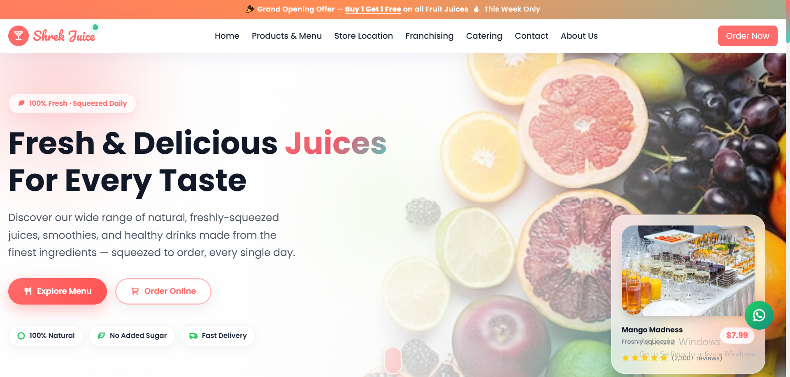
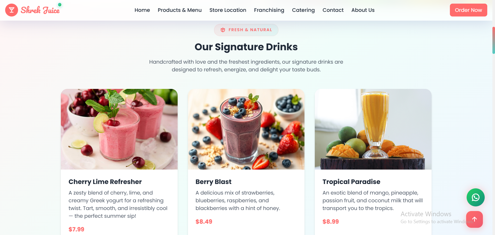
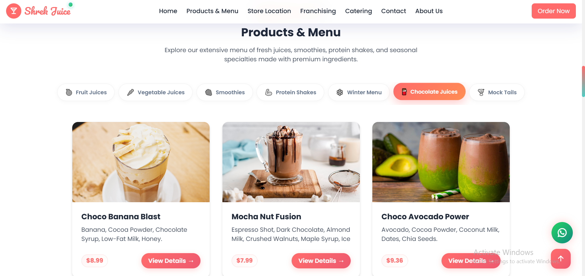
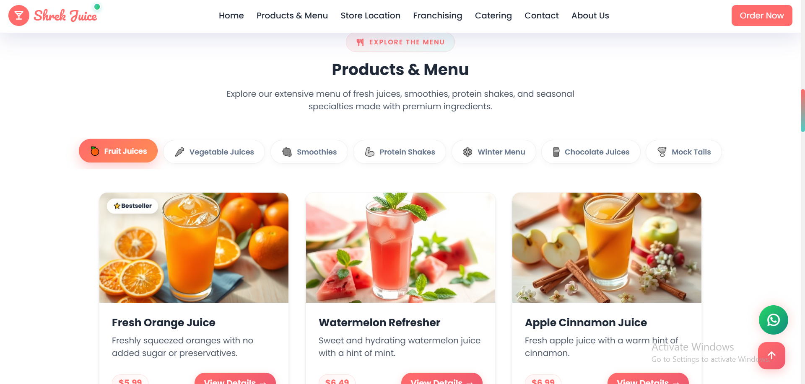
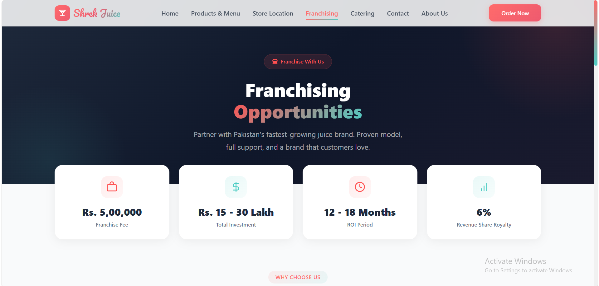
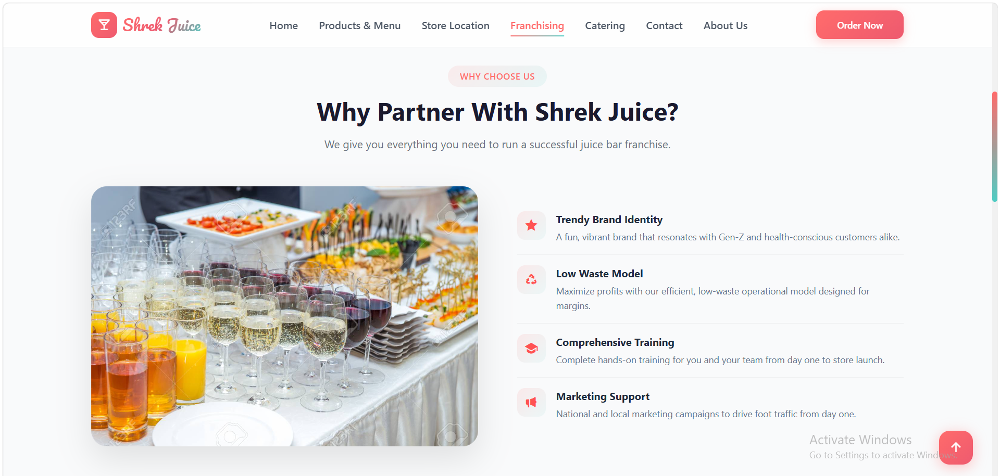
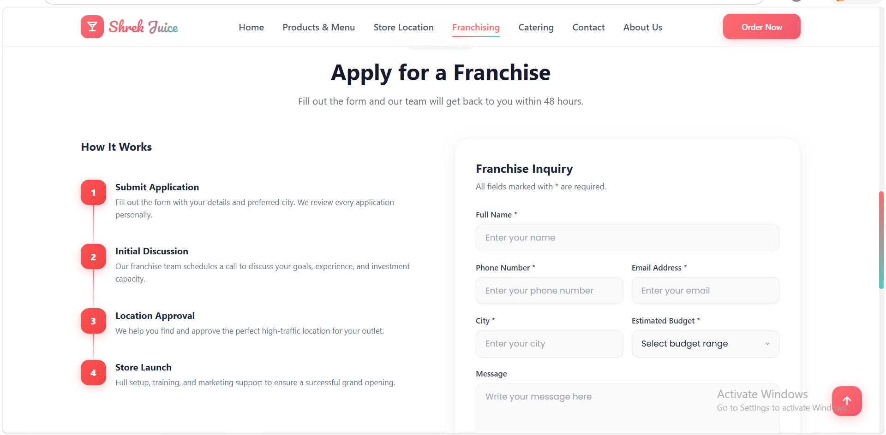
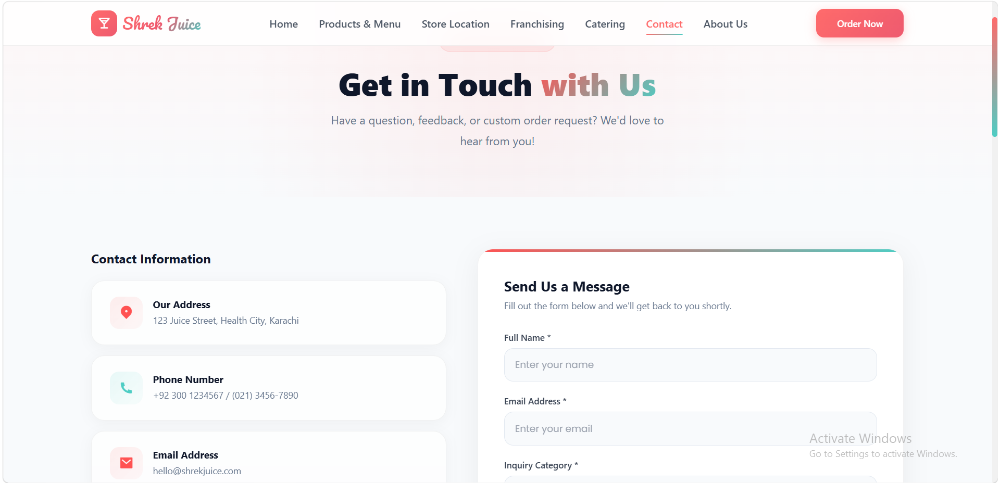
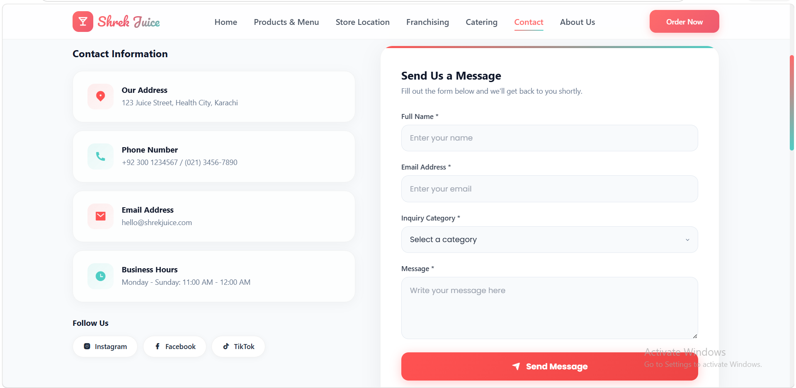

# 🥑 Shrek Juice Centre

A premium, modern, and fully responsive multi-page website for **Shrek Juice Centre** — a top-tier juice bar based in Karachi, Pakistan. 

This website is designed with a vibrant, fresh, and modern aesthetic. It features a complete online menu showcasing 40+ products, interactive detailed modals with nutritional information, catering packages, franchising details, and a functional contact system.

---

## 📸 Screenshots Showcase

Here is a visual walk-through of the website. These screenshots demonstrate the rich styling, clean card layouts, and intuitive interface design across different pages:

### 🏠 Home & Signature Drinks
| Homepage Header | Signature Drinks Section |
| :---: | :---: |
|  |  |

### 🍔 Menu Grid & Item Details
| Interactive Menu Grid | Product Detail Modal (with Nutrition & Sizes) |
| :---: | :---: |
|  |  |

### 🥗 About Us & Franchising Overview
| About Us / Our Philosophy | Franchising Requirements & Benefits |
| :---: | :---: |
|  |  |

### 💼 Franchising Details & Form
| Simple Steps to Partner | Franchising Inquiry Form |
| :---: | :---: |
|  |  |

### 📞 Contact Info & Interactive Maps
| Contact Info & FAQs | Inquiry Form & Map Placement |
| :---: | :---: |
|  |  |

---

## 🚀 Live Demo / How to View

To view the website on your local machine:
1. Download or clone this repository.
2. Double-click the [`index.html`](index.html) file to open it in your web browser.

> 💡 **Tip:** If you deploy this repository to **GitHub Pages**, you can view the live interactive website directly in your browser without downloading any files!

---

## ✨ Features

- **📱 Fully Responsive Layout** — Optimized for desktops, tablets, and mobile screens with a responsive hamburger navigation menu.
- **✨ Vibrant & Modern UI** — Curated color palette featuring soft corals, leafy greens, and crisp layouts matching a premium juice bar theme.
- **🍉 Extensive Menu (40+ Products)** — Grouped into 7 distinct categories (Fruit Juices, Vegetable Juices, Smoothies, Protein Shakes, Winter Menu, Chocolate Juices, Mocktails) with smooth interactive tabs.
- **🔍 Product Detail Modals** — Clicking any menu item opens a beautiful popup displaying sizes, prices, nutritional info, ingredients, and an interactive "Add to Cart" quantity selector.
- **🎉 Catering Packages** — Clear information on tiered catering services (Basic Sip, Fiesta Blend, Royal Splash) to book events.
- **🏢 Franchising Application** — Detailed partnership process, pricing stats, and a dynamic application form for prospective franchise owners.
- **📩 Functional Contact Form** — Fully integrated with **EmailJS** to send user submissions directly to the business email inbox.
- **🗺️ Interactive Map & Socials** — Embedded Google Maps for store locations, plus fully-linked icons for WhatsApp, Facebook, Instagram, TikTok, and X.
- **🔝 UX Improvements** — Smooth scroll-to-top button, interactive hover effects, and CSS micro-animations.

---

## 🛠️ Tech Stack

- **HTML5** — Semantic page structure.
- **CSS3** — Custom layout stylings, page specific sheets, and custom animations.
- **Tailwind CSS 3.4** (via CDN) — Utility-first responsive spacing, grids, and rapid layout design.
- **Vanilla JavaScript** — High performance DOM manipulation for modals, tabs, active states, and cart quantities.
- **Remix Icon 4.6** — Sleek, vector-based iconography.
- **EmailJS SDK** — Direct client-side email dispatching.
- **Google Fonts** — Styled using *Pacifico* (for headings/branding) and *Poppins* (for body text).

---

## 📂 Project Directory Structure

```
project/
├── index.html              # Main homepage & product menu
├── catering.html           # Catering services and packages
├── contact.html            # Location info, FAQs, and contact form
├── franchaising.html       # Franchise partner benefits, stats, and form
│
├── css/
│   ├── common.css          # Global navbar, footer, and basic typography styles
│   ├── home.css            # Styles for homepage, hero banner, tabs, and modals
│   ├── catering.css        # Styles specific to the catering layout
│   ├── contact.css         # Styles specific to the contact layout
│   └── franchaising.css    # Styles specific to the franchise layout
│
├── js/
│   ├── common.js           # Shared utilities (mobile menu toggle, scroll-to-top)
│   ├── home.js             # Menu tabs filtering, modal popup info, quantity handler, EmailJS
│   └── catering.js         # Interactive features on the catering page
│
├── img/                    # Optimized assets and product photography
└── readme_image/           # Screenshots shown in this README
```

---

## 🔧 Local Configuration

### 📧 EmailJS Setup
To receive emails from your Contact Form:
1. Sign up for a free account at [EmailJS](https://www.emailjs.com/).
2. Connect an Email Service (e.g. Gmail) and create an email template.
3. Replace the Public Key inside [`js/home.js`](js/home.js):
   ```javascript
   emailjs.init('YOUR_PUBLIC_KEY');
   ```
4. Update the service ID and template ID in the submit handlers to match yours.

---

## 📝 License

This project is open-source and available under the **MIT License**.
